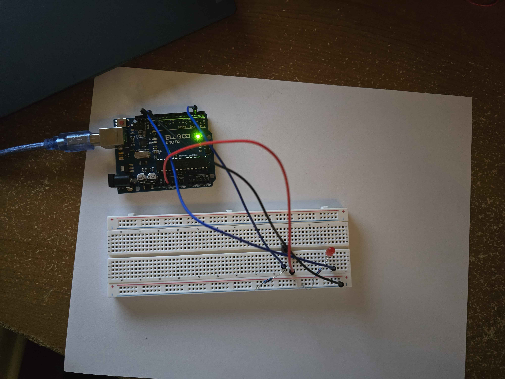
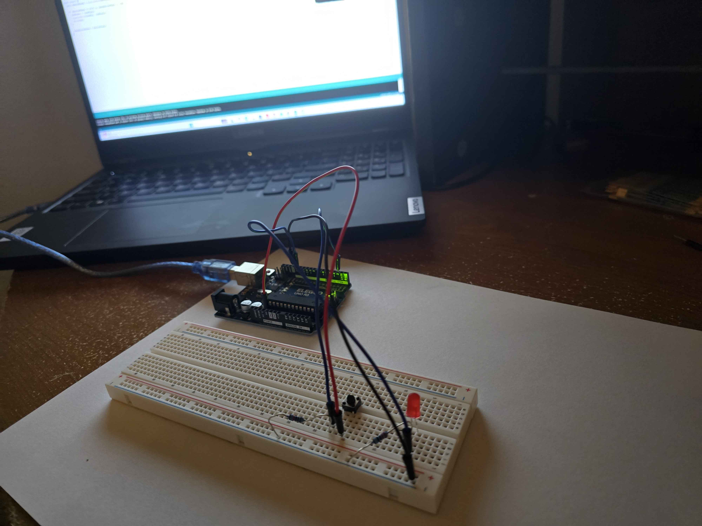
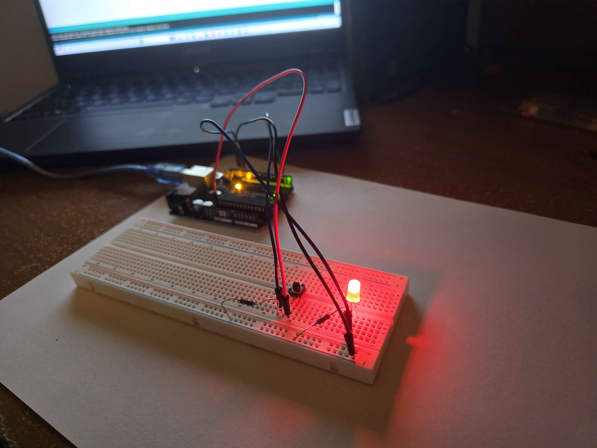

# Project 02 — Button Controlled LED (Toggle)

## What It Does
A pushbutton toggles an LED on and off. Each press switches 
the LED state — one press turns it on, next press turns it off.
Upgraded from basic hold behavior to toggle using state tracking.

## Photos

  

  

## Components Used
- 1x Arduino Uno
- 1x Breadboard
- 1x Red LED
- 1x 220 ohm resistor
- 1x Pushbutton
- 1x 10k ohm resistor
- Jumper wires

## Circuit Wiring
- Button one leg → 5V
- Button opposite leg → Pin 2
- 10k resistor from Pin 2 row → GND (pull-down)
- LED long leg → Pin 13
- LED short leg → 220 ohm resistor → GND

## What I Learned
- digitalRead() returns HIGH or LOW based on voltage on a pin
- Difference between hold behavior and toggle behavior
- State tracking using boolean variables
- Button debouncing using delay(50) prevents multiple 
  triggers from one physical press
- How to debug hardware using Serial Monitor

## Challenges
LED was staying on and not turning off after pressing button. Used Serial Monitor to print buttonState every loop cycle. Saw value was constantly 1 without pressing button, indicating floating pin. Diagnosed as pull-down resistor wired to wrong side of button — moved 10k resistor from 5V side to pin 2 side. Serial Monitor then showed 0 at rest and 1 only when pressed. Bug resolved.

## Next Steps
- Add second LED that toggles opposite to first
- Add buzzer that beeps on each toggle
- Control brightness with potentiometer

## Date Completed
April 11 2026
