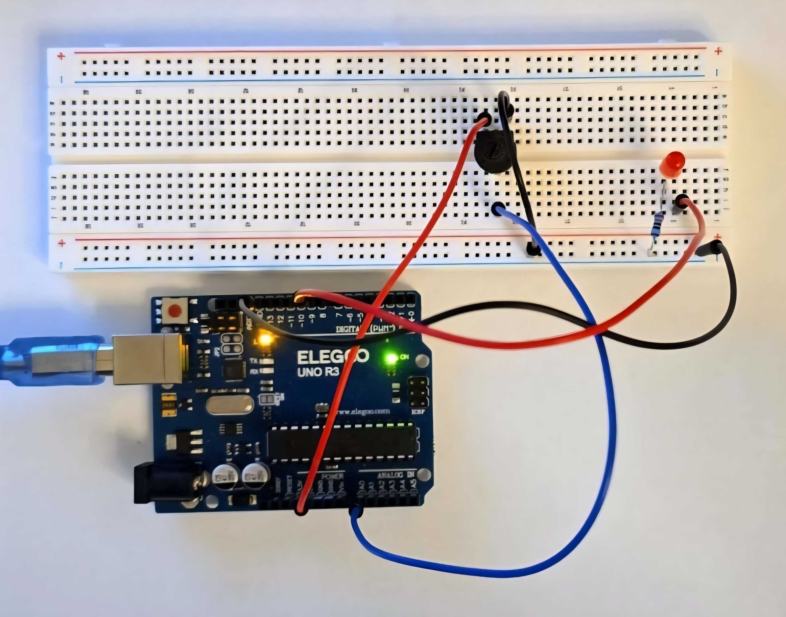

# Project 03 — Potentiometer LED Brightness

## What It Does
A potentiometer's position is read as an analog voltage and mapped
to a PWM brightness value. Twisting the dial fades an LED from
completely off to full brightness in real time.

## Photos

  

## Components Used
- 1x Arduino Uno
- 1x Breadboard
- 1x Red LED
- 1x 220 ohm resistor
- 1x Potentiometer
- Jumper wires

## Circuit Wiring
- Potentiometer single pin (wiper) → A0
- Potentiometer leg 1              → GND
- Potentiometer leg 2              → 5V
- LED long leg                     → Pin 9
- LED short leg                    → 220 ohm resistor → GND

## What I Learned
- **ADC (Analog to Digital Conversion)** — analogRead() converts
  a continuous voltage (0-5V) into a discrete number (0-1023).
  This is how microcontrollers read analog signals from the
  real world.

- **PWM (Pulse Width Modulation)** — a digital pin can only be
  fully on or fully off. PWM simulates intermediate voltages by
  rapidly switching on and off. The ratio of on-time to off-time
  (duty cycle) controls the average power delivered. At high
  enough switching speeds the transitions become invisible to
  the human eye, making an LED appear to smoothly dim.

- **map() function** — scales one number range to another.
  Converts the ADC range (0-1023) to the PWM range (0-255)
  so the full dial rotation uses the full brightness range.

- **Serial Monitor for verification** — printing potValue and
  brightness in real time confirmed the conversion was working
  correctly before testing with the LED.

- **Hardware constraints affect design** — the potentiometer's
  form factor made standard breadboard placement impractical.
  Used female-to-male jumper wires to mount it off-board,
  keeping the circuit accessible. Real prototypes often require
  this kind of practical adaptation.

## Challenges
> Standard male-to-male jumper wires crowded around the
> potentiometer knob making it impossible to turn. Solved by
> using female-to-male jumper wires to connect the potentiometer
> off the breadboard entirely, giving full access to the dial.
> This mirrors real product design where controls are physically
> separated from the main circuit for usability.

## Next Steps
- [ ] Add LCD display showing brightness as a percentage
- [ ] Add second LED fading in opposite direction
- [ ] Map potentiometer to buzzer frequency instead of brightness

## Date Completed
April 14 2026
