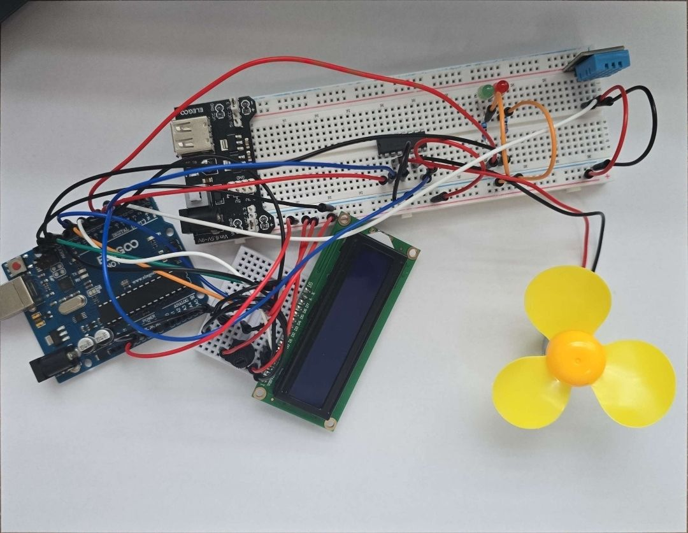
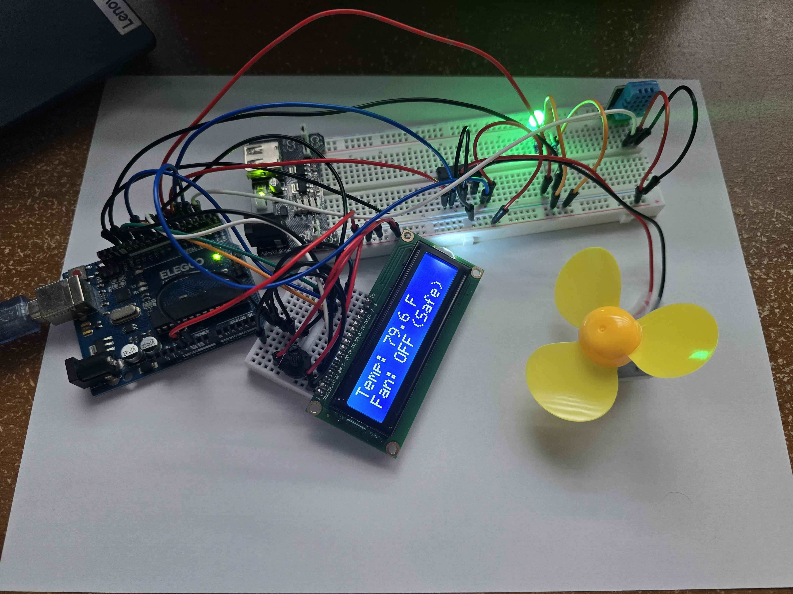
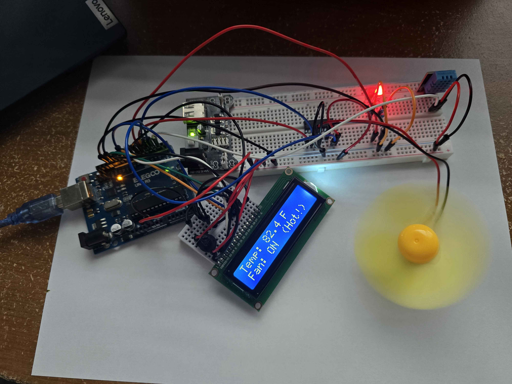

# Automatic Temperature-Controlled Fan

An Arduino project that monitors ambient temperature using a DHT11 sensor and automatically controls a fan via an L293D motor driver. When the temperature exceeds a set threshold, the fan turns on to cool the environment. Temperature and fan status are displayed on an LCD1602, and LED indicators provide a visual status at a glance.

## Inspiration

The idea came from thinking about energy waste. Fans and cooling systems that run constantly regardless of whether they actually need to. Bathroom exhaust fans run long after the humidity clears, PC case fans in budget builds spin at full speed 24/7, and garage or shed fans get left on all day even after the space has cooled down. This project solves that by only activating the fan when the temperature exceeds a set threshold, saving energy while keeping the environment cool. On top of that, the whole system is fully automated — once it's set up, it monitors and responds to temperature changes on its own without any manual input. No lifting a finger.

## How It Works

The Arduino reads the temperature every 2 seconds from a DHT11 sensor. If the temperature reaches or exceeds the threshold (default: 82°F), the L293D motor driver activates the fan at full speed and the red LED turns on. When the temperature drops back below the threshold, the fan shuts off and the green LED turns on. All readings and status are displayed live on the LCD.

## Photos

## Components

| Component | Quantity |
|---|---|
| Arduino Uno (or compatible) | 1 |
| DHT11 Temperature & Humidity Sensor | 1 |
| L293D Motor Driver IC | 1 |
| DC Fan / DC Motor | 1 |
| LCD1602 Display | 1 |
| 10kΩ Potentiometer (LCD contrast) | 1 |
| Green LED | 1 |
| Red LED | 1 |
| 10kΩ Resistor (DHT11 pull-up) | 1 |
| 220Ω or 330Ω Resistors (LEDs) | 2 |
| Jumper Wires | As needed |
| Breadboard | 1 |

## Wiring

### DHT11
| DHT11 Pin | Arduino Pin |
|---|---|
| VCC | 5V |
| Data | Pin 2 |
| GND | GND |

> Note: Place a 10kΩ pull-up resistor between the Data pin and 5V.

### L293D Motor Driver
| L293D | Arduino Pin |
|---|---|
| ENABLE | Pin 5 (PWM) |
| DIRA | Pin 3 |
| DIRB | Pin 4 |

### LCD1602
| LCD Pin | Arduino Pin |
|---|---|
| VSS (pin 1) | GND |
| VDD (pin 2) | 5V |
| V0 (pin 3) | Potentiometer middle leg |
| RS (pin 4) | Pin 7 |
| RW (pin 5) | GND |
| E (pin 6) | Pin 8 |
| D4 (pin 11) | Pin 9 |
| D5 (pin 12) | Pin 10 |
| D6 (pin 13) | Pin 11 |
| D7 (pin 14) | Pin 12 |
| A (pin 15) | 5V |
| K (pin 16) | GND |

> Connect potentiometer outer legs to 5V and GND. Adjust knob to set contrast.

### LEDs
| Component | Arduino Pin |
|---|---|
| Green LED (fan off) | Pin 6 |
| Red LED (fan on) | Pin 13 |

> Wire each LED with a 220Ω or 330Ω resistor in series between the Arduino pin and the positive leg.

## Dependencies

Install the **DHT sensor library by Adafruit** via the Arduino Library Manager:

1. Open Arduino IDE
2. Go to **Sketch → Include Library → Manage Libraries**
3. Search for `DHT sensor library` by Adafruit and install it

The `LiquidCrystal` library is built into Arduino IDE — no installation needed.

## Challenges & What I Learned

This was my first time working with both a motor driver and an LCD display, so there was a solid learning curve.

The biggest challenge was wiring. With the DHT11, L293D motor driver, LCD1602, and LEDs all running at the same time, the breadboard got very messy very fast. I ended up having to move the LCD to a separate mini breadboard just to have enough space to work cleanly.

Getting the components to actually work also took some troubleshooting. The DHT11 kept throwing sensor errors until I got the wiring sorted out, and I had to figure out how to install external libraries for both the sensor and the LCD display. The LCD in particular took some back and forth. I had to adjust the contrast potentiometer and double check each of the 16 pins before it started displaying text correctly.

Through this project I learned how to use the L293D motor driver to control a DC motor, how to wire and program an LCD1602 display, how to install and use external Arduino libraries, and how to debug hardware issues when things don't work the first time.

## Future Improvements

- Variable fan speed using PWM proportional to temperature
- Multiple speed thresholds (low / medium / high)
- Temperature data logging to SD card
